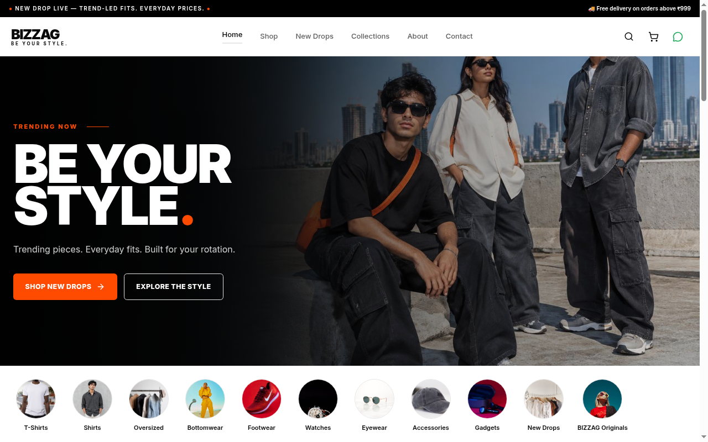

# BIZZAG

**BE YOUR STYLE.** An online clothing store for trending T-shirts, shirts and oversized tees. Customers browse the catalogue, add pieces to a cart and send their order to the shop over WhatsApp.

**Live site:** https://bizzag.vercel.app

## Screenshots

<p align="center">
  
  
</p>

## Features

- Product catalogue with category circles, filters and sorting
- New Drops page for the latest pieces
- Product detail pages with size selection
- Cart that sends the item list, sizes and total to WhatsApp, no login needed
- Admin dashboard code for products and photos (not configured on the live deployment)
- Responsive layout with a mobile bottom navigation bar
- Server-side rendering with query hydration and reserved image dimensions, so the page does not jump while loading

## Tech stack

- [TanStack Start](https://tanstack.com/start) with TanStack Router (file-based routes) and TanStack Query
- React 19 and TypeScript
- Tailwind CSS 4 with Radix UI primitives
- Supabase for the database and product photo storage
- Vite and Nitro for the build
- Deployed on Vercel

## Performance

Mobile Lighthouse (lab, simulated throttling) went from 36 to 87-94 after five focused changes: deferring off-screen images, reserving image dimensions, defining the Inter font face directly, preloading the font and preconnecting to image origins, and hydrating prefetched queries without duplicate requests. Lab numbers vary between runs.

## Getting started

Requires Node.js and npm.

```sh
git clone https://github.com/irfanahmed0019/bizzag-engine.git
cd bizzag-engine
npm install
cp .env.example .env   # then fill in your own values
npm run dev
```

Other scripts:

| Command | What it does |
| --- | --- |
| `npm run dev` | Start the dev server |
| `npm run build` | Production build |
| `npm run preview` | Preview the production build |
| `npm run lint` | Run ESLint |
| `npm run format` | Format with Prettier |

## Environment variables

Copy `.env.example` to `.env` and set these. Never commit real values.

| Name | Where it is used |
| --- | --- |
| `VITE_SUPABASE_URL` | Browser, Supabase project URL |
| `VITE_SUPABASE_PUBLISHABLE_KEY` | Browser, publishable key |
| `VITE_SUPABASE_PROJECT_ID` | Browser, project id |
| `VITE_ASSET_HOST` | Browser, asset host |
| `SUPABASE_URL` | Server |
| `SUPABASE_PUBLISHABLE_KEY` | Server |
| `SUPABASE_SERVICE_ROLE_KEY` | Server only, used by admin writes. Keep secret |
| `ADMIN_EMAIL` | Admin sign-in |
| `ADMIN_PASSWORD` | Admin sign-in |
| `SESSION_SECRET` | Random string used to sign the admin cookie |

On Vercel, add the same names under Project Settings, Environment Variables, then redeploy.

## Project structure

```
src/
  assets/          Images and static assets
  components/
    site/          Header, footer, product cards and other storefront pieces
    ui/            Shared UI primitives
  hooks/           React hooks
  integrations/    Supabase client setup
  lib/             Catalogue queries, cart, WhatsApp message builder, admin functions
  routes/          File-based routes (home, shop, new-drops, collections, cart, admin, ...)
  router.tsx       Router and query client setup
  styles.css       Tailwind theme and global styles
```

## Deployment

The project deploys to Vercel from the `main` branch.

## Security notes

Admin writes require a signed session and server-only credentials. Public inputs are bounded, login throttling is per server instance, and cross-origin server calls are restricted to this storefront. WhatsApp totals are estimates, not authoritative paid orders. Customer-photo privacy and fleet-wide abuse controls need a separate deployment review. Never commit secrets.
